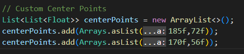

## Input Data Set

We give the program our dataset and it perform K Mean Clustering on the given dataset.
 
| X Coordinate | Y Coordinate |
| ------------ | ------------ |
| 185 | 72 |
| 170 | 56 |
| 168 | 60 |
| 179 | 68 |
| 182 | 72 |
| 188 | 77 |
 
You can also give you own csv file by changing this line to you csv file name.

![Read CSV file](data:image/png;base64,iVBORw0KGgoAAAANSUhEUgAAATQAAAA/CAYAAABuMTToAAAAAXNSR0IArs4c6QAAAARnQU1BAACxjwv8YQUAAAAJcEhZcwAADsMAAA7DAcdvqGQAAAh/SURBVHhe7Zw9ixRJGMfvk2ykiRgJq6BgsiYLcgPCRS7LggvChkYLKsJuIiLIBQbiHYIGIhiokYGZcrCBRhvJfYj9BFdXr9318lTX0z1jT0/NP/ih01Vd9XTNPL95qnv0t42NDQEAADUAoQEAqgFCAwBUA4QGAKgGCA0AUA0QGgCgGiA0AEA1QGgAgGqA0AAA1QChAQCqAUIDAFQDhAYAqAYIDQBQDRAaAKAa5hLahf1tcfBkU1wg2hqubIrdF9ti6wrRViF6TV780bC7f57sBwBYPHMI7aK4JRP21oxqa7l8KBP78CLZlue82HrSSsGnNN90MOsDoQEwHsOFNrsuBXNdXKbaGnjSS7FC6y3CKQGhATA2A4VmhFNKVtaWlARCAwD0Z5jQWPfFeNKjYQhNV4iyTyRMvcWNq0LXt8GvLF0Vaf5057pxmviba7ax2b75GAtC0+N54wwRvx0jrIDpeeN7ewfU+9e5TpY47kxft36O1blVAFaZQULTH9ZSAurkGPowgFmh2QRskte+DpJHJWAwjh27id+JzMSqrm33ybYe00jAJqqXyKHkctLqEBqxNqw1jeEKjfNeFNfJ9onGNuLyZUa8d2ScACyeAUIzCVP6cOoPeklIWaIqqCFNSiMddbxDIBGBqJzQbKx+glJCi8fPiygXj7m25LgevyCdGFIU6bzh9fJJzqPEGB/Tr9O55vs8AMCjt9BYyTH3NzLxLd+BkVBOLF57gLuGUAC+oCihxdeUX4+c0KxAM/RaM6bQwjnz0uxeJ4mdzx/bXy/12qxHPIYl8/4AsCh6Ci1TXUToD/VcH94+QvOruVQsJknDJA4ltAChkdfaLbTSGrJgC83hr1V4XnmdFL4YHeGap+cAMB79hKYTKP8Nb+BJrxu+0EwiqgSizqHHWaTQdH8yzpxY+NdWpLfQHHEMnHWyr0tfVJz7dQD8InoJLZ+8Hpl7KP1gJr2ey0tom+B+MvuCUq9NkspjCxCaac8lb4dYbNzd0uEQz2Fel8dOYyuvU7QeWex7N/dnAID+9BCaSYK4QolhSa+IS4oUN3+TcGRVQSe5RiVtIN0wuUtCa8bRpEmrz0/6KaK+VmoBnlDYBOMouZq1S2TlzyNJhVdaJ0X5fenqV/rsADAvbKGxvp0z27IqqPnamMRVXHC89NkAYASYQku/9Sm09IZUGavA2gvNVl3J+5s7DsD49HsosM6gQpNE21LH3LcYAFgMEBoAoBogNABANUBoAIBqgNAAANUAoQEAqgFCAwBUA4QGAKgGCA0AUA0TF9oNcenLB/H7yQdx9SHVviyOxd3v/4m//m25/zjsc/nNmWn7/DY4rnn8MziX7APYPLp3KH78eSje35Svb97Wf/9x7xrZl8PO3kF+DDe+Y455psii13Js+gnt4TMtl4YvD8S5pJ+V0Lv96PgQpim02Wcpoe/fOv/tYqfQGqwYBwotN4c+XoivJoyADsTLTfl6c1t8TZLwonh5bAUUoRPXG0vRKbQGO2ZlQiuv5bRhC+3c89dSLK/FpR3v+M4DsZWIa5FCmyJvxX0pkbgiG8YihHYmnn7/KWbx8TUX2tc9/59j/Qr5rI/QwrWcNkyh9ZFU5UK78008nZTQfoq78s+nb47D4+sqtI1r4j2ENpjyWk6bfkIjt5gWVa3529GIdstoxtp6fiPawvrVn52PbAv7qHFM9ej6Pkv+14ew3WOIdAtCM5KRkrL4okkpCS2+V3cm7t5p253QZiomT2CU0OK4gnZ9T0+O09zbUxWfqUTjOUsxTROefEwyy36W7kQujWnbm/GcJAbgtn4OYs449mA+e366vTbCGiblXfHqn1NxenoiXu1R7cuBfw/Nk0/3/axShebLqpXPhXfyNSVMPW9eaKGY9sXVSFTpVjntUyZO4giyGjJCGC404nwtnFYgjdDk39V9PSfZRGjyvDAOKys3rxOZPke1qW2smieOrxzTNOlbTXEqk64xifP1DfYBUrM35uOxAjkVx7axHm+LHf/40Jg0qy40jZWBg5QCU2iRvIx40uqqKLRonliMlCiz8uTA3nLOJzSqynL93Zi+0LRY7Dj0uSHBgw0rNHNNvuzC+Dgx8TgSH09VMlD8igSJqyXHbfGI7D+f0HS1FMvD9u8eM4ZXQZnqLHctFkJe+olmEudq01NoLc02LhEDU2jcCmlOoeUqNL3ltX16MZLQtHCUWCh8wTih2cpKVUqpeOw88TiB0FyV5ccdxseJaZp0VVMU8wnN/fSBhB2DJLtVjLHi0+QqrviazOvy2KvFYKFp7DY03IJOS2guxgDu3BRjCq1QZYVCM6/VfKHQnMzafoq0QmMKrRDTNFmC0BZR+bCF5rAxabGl5wWVo67YClXdClK50EyfwdUYxZhbzkhCMUkf+3BgFgiNjmOI0Dgx8VjSlnMkobG2gCw4cVBkYtOCNBWckm7/cacPU2hym5bbWibHrVSo+2Ga8YXGnovDSEJz53dVRJRgZp/PxH1Je146R7N17Ck0TkzTZFyhufN5VZrtK6EqMff0MmiLHwok5OI3MX/d25btQx8GONxDgVPx8ZhqXw78Co36WUZWFFYkXt/4ZxvdkokePvg053GEJsn+nCQn3AIFoTWySGjFY0RE9XFScViBZPqQFZO9wR9Ix8bcjCEFpc/tLbS2vY1HEcc9NXhCy9/7aqstJ5iUWBCtqPJ9JN5PMrKS0ttDb5zoOqi4szJ2Y7Hlnufok62qPx2R7ctgvi3n5Mk9ALDCXGTlBsC6sfdKnEBoI2Krs0RoueMAADamQlvp36GtINRTTkn3j4MBADl2/z6xD3A+iiOifZnULzQAwNoAoQEAqgFCAwBUA4QGAKgGCA0AUA0QGgCgGiA0AEA1QGgAgGqA0AAA1QChAQCqAUIDAFTChvgfNhR+cNBsP7cAAAAASUVORK5CYII=)

 
The Center Points Given are (185,72) and (170,56). The center points can be changed according to your needs. such as

 
## Output

At the end the program would return us the clusters and the points in each cluster having minimun distance to the center.
 
| Points in Cluster |  |  |  |  |
| ----------------- | --- | --- | --- | --- |
| Cluster 0 | 0 | 3 | 4 | 5 |
| Cluster 1 | 1 | 2 |  |  |