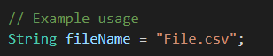

## Input Data Set

We give the program our dataset and it perform K Mean Clustering on the given dataset.
 
| X Coordinate | Y Coordinate |
| ------------ | ------------ |
| 185 | 72 |
| 170 | 56 |
| 168 | 60 |
| 179 | 68 |
| 182 | 72 |
| 188 | 77 |
 
You can also give you own csv file by changing this line to you csv file name.

 
The Center Points Given are (185,72) and (170,56). The center points can be changed according to your needs. such as

 
## Output

At the end the program would return us the clusters and the points in each cluster having minimun distance to the center.
 
| Points in Cluster |  |  |  |  |
| ----------------- | --- | --- | --- | --- |
| Cluster 0 | 0 | 3 | 4 | 5 |
| Cluster 1 | 1 | 2 |  |  |